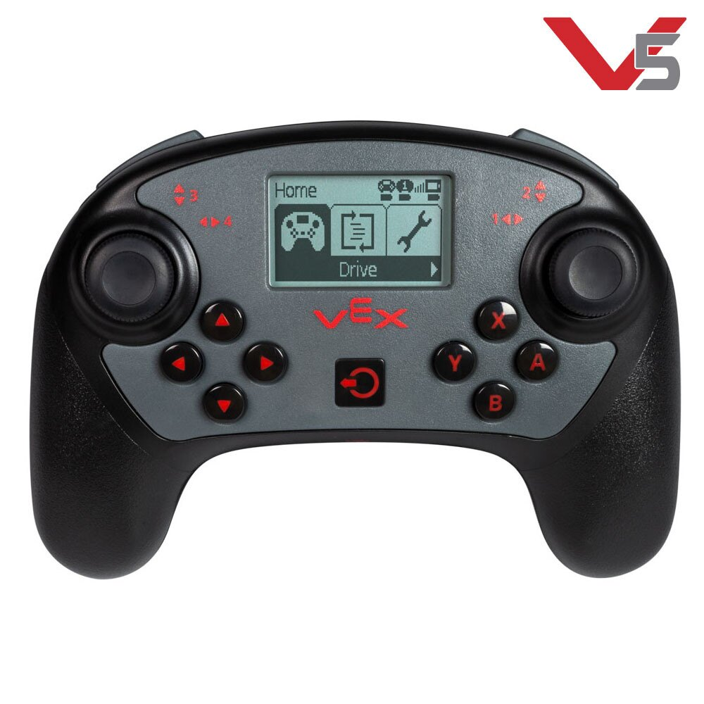
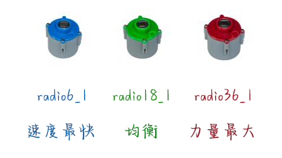
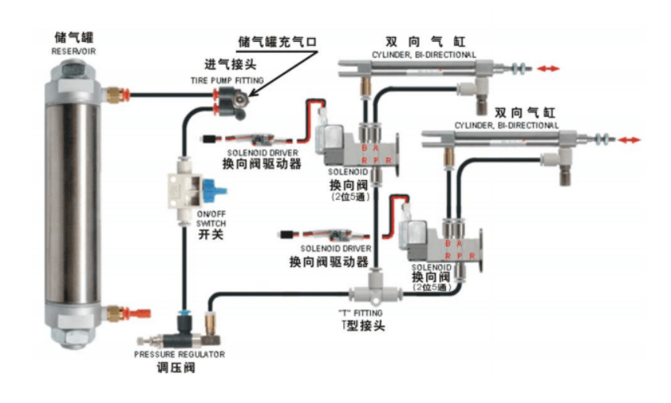

---
VEX程序 ~~基本~~ 知识
---

# 序言
## 语言基础说明  

VEX程序可以支持 _C++_ 和 _python_ ，但是在这里只涉及 ___C++___     
如果有 _python_ 基础而没有 _C++_ 基础，建议访问[菜鸟教程](https://www.runoob.com/cplusplus/cpp-tutorial.html)来学习语法知识  
如果编程基础近似为0而对编程有兴趣的同学，建议先在[洛谷题单](https://www.luogu.com.cn/training/list)完成入门系列之后再来看VEX的教程

## 编译环境
支持VEX程序的软件有 [vscode](https://code.visualstudio.com/sha/download?build=stable&os=win32-x64-user) 、_VEXcode pro v5_ 等，本教程只介绍 ___vscode___ 的使用  
点击此处的链接可以下载到 _vscode_ 的安装包  
打开 _vscode_ 之后，需要下载拓展 _chinese_ , _c/c++_ , _VEX Robotics_   
`如果有兴趣可以追加拓展 Better C++ Syntax 、 C/C++ Compile Run 、 Dracula Official 、 CodeGeeX 等`   
另外，为了防患于未然，下载一个 _git_ 和及时把代码上传到 _github_ 是相当的有必要的  
（我才不会告诉你我有一次文件损坏了只好从头重写呢）  
下载 _git_ 只需要跟着 _vscode_ 的窗口一通按就好了，如何使用请看网上的[教程](https://www.runoob.com/git/git-tutorial.html)  
可以点击 _打开文件夹_ 来开始你的代码

## 硬件条件

### 主机  
  

### 手柄  
  

  

### 场控   
  

### 钢条   
  

### 传感器   
  

### 电机   
  

### 气泵   
  

## VEX社区
    VEX在[B站](https://www.bilibili.com/)中并不算极小众的，其中更新的比较多的up主是[TXTaylor297992](https://space.bilibili.com/1684280853)   
    此外，VEX有[中文官方论坛](https://vexforum.cn/)，在这里可以下载到官方给出的规则文档和场地拼接的文档

# 面向对象
## 面向对象思维的介绍及引入
[wiki介绍](https://zh.wikipedia.org/wiki/%E9%9D%A2%E5%90%91%E5%AF%B9%E8%B1%A1%E7%A8%8B%E5%BA%8F%E8%AE%BE%E8%AE%A1)     
程序设计思维中，与 ___面向对象___ 相对的概念叫做 ___面向过程___ 。     
后者考虑问题是通常把问题拆分成几个小问题，在编写程序中对应的行为一般有编写若干个函数。由于OI中一般只要考虑一个主问题即可，所以面向对象在OI中出现较多     
前者则是将一个个功能封装进 _对象_ 中，其对应的行为以实现 _类(class)_ 为典型。这种程序设计的思维在 项目化编程 中有极大的优点——重用性、灵活性和扩展性 高
在此处，我们将从[class](https://www.runoob.com/cplusplus/cpp-classes-objects.html)的声明、定义、使用来入手，切实的感受 ___面向对象___ 的代码风格
## classの定义     
[](https://www.runoob.com/cplusplus/cpp-classes-objects.html)
### 类 及 类名
给类取名的时候，可以参照[struct](https://www.runoob.com/cplusplus/cpp-data-structures.html)，命名规则和变量一致
类的名字以及成员变量 ___最好___ 有实际意义，例：
```cpp
class student{
    private:
    string name;//人的名字
    int c,m,e;//C代表语文，M代表数学，E代表英语
};
```
### [访问修饰符](https://www.runoob.com/cplusplus/cpp-class-access-modifiers.html)     
`本教程不涉及 继承 以及 protected 的使用，因为本教程用不到它们`
- public
    公有成员在程序中类的外部是可访问的
    public下的成员变量以及成员函数的使用与`struct`无异
- private
    成员和类的默认访问修饰符是 private      
    私有成员变量或函数在类的外部是`不可访问`的，甚至是`不可查看`的。只有`类和友元函数`可以访问私有成员。
    例:
    ```cpp
    class Box {
    private:
        double width;
    public:
        double length;
        void setWidth( double wid );
        double getWidth( void );
    }b;  //相当于换行写了   Box b;
    ```
    在这个例子中，变量width的访问修饰符是private，因此`b.width`的写法是非法的     
    正确的做法是，通过`b.setwidth(double wid)`来设置`width`的值；
    通过`b.getWidth()`来获得`width`的值     
    类似这种 __在私有区域定义数据，在公有区域定义相关的函数，以便在类的外部也可以调用这些函数__ 的做法一般叫做 ___数据封装___      这样能避免受到外界的干扰和误用，从而确保了安全     
    样例中的`length`就不符合数据封装的原则，不要这样写 ~~否则你有可能会被狠狠批斗的~~
### [重载函数和重载运算符](https://www.runoob.com/cplusplus/cpp-overloading.html)
#### 重载函数
C++ 允许在同一作用域中的某个函数和运算符指定多个定义，分别称为函数重载和运算符重载。     
在同一个作用域内，可以声明几个功能类似的同名函数，但是这些同名函数的**形式参数**（个数、类型或顺序）必须不同。     我们不能仅通过**返回类型**的不同来重载函数。
重载函数可以为我们调用功能较相近的函数时提供便利,例:
```cpp
// 哦对了，重载函数在class外也是可以使用的哦
void swap(int& a,int& b)      {int t=a;a=b;b=t;}
void swap(float& a,float& b)  {float t=a;a=b;b=t;}
void swap(bool& a,bool& b)    {bool t=b;a=b;b=t;}
// 以下是在类中使用的
class printer{
    public:
       print(int a)   {cout<<a;}
       print(float a)   {cout<<a;}
       print(string a)   {cout<<a;}
};
//错误示范
int f(void){void}
float f(void){void}
//主函数
signed main(){
    printer p;
    p.print(114514);
    p.print("\n1919810\n");
    int a,b;
        cin>>a>>b;
        swap(a,b);
        cout<<a<<' '<<b<<endl;
        return 0;
}
```
#### 重载运算符
在c++中，运算符实际上也可以看作是一种函数，因此，就出现了**重载运算符**的用法     
在这里我们介绍 [赋值运算符  = ](https://www.runoob.com/cplusplus/assignment-operators-overloading.html)     
多说无益，直接上样例：
```cpp
class node{  //平面直角坐标系中的一个点
    private:
        int x,y; //坐标
    public:
        void operator= (const node& n){  
            //此处const node& n 也可以写作node n
            //使用&是为了提高效率，使用const是为了防止n的值被这里的赋值函数更改
            x = n.x;    // 等效于 this->x = n.x;
            y = n.y;    // 等效于 this->y = n.y;
        }
        friend istream operator>>(istream& in,node& n){
            // 不要求掌握，看看就好
            in>>n.x>>n.y;
            return in;
        }
};

signed main(){
node n;
    node m;
    cin >> n;
    m = n;
    // ...
    // 这段代码没有什么意义，只是为了说明重载运算符后类的运算就可以用符合我们原有习惯的写法来编写程序这一点而已
    return 0；
}
```
可以看出，使用重载运算符的写法非常符合我们对变量的编写习惯。  
这使得我们在使用类时感到非常的舒适 XD  
需要注意的是，所有的运算符函数都是放在 ___public___ 访问修饰符下的     (其中 流运算符 是以友元函数的形式)

### [构造函数和析构函数](https://www.runoob.com/cplusplus/cpp-constructor-destructor.html)，[拷贝构造函数](https://www.runoob.com/cplusplus/cpp-copy-constructor.html)     
这三个函数是类中非常特殊的函数。通过它们可以实现 **初始化新对象**、**释放对象占用内存**、**复制对象** 的作用     
如果不编写这三个函数，编译器都会自动加入这几个函数。但是如果类中涉及到**指针**和**动态内存**时需要格外注意，此时必须人为的编写 *析构函数* 和 *拷贝构造函数*     
切记，这三个函数都应放在 ***public*** 下
#### 构造函数
类的构造函数会在**每次创建类的新对象时**执行。     构造函数的名称与类的名称是完全相同的，并且不会返回任何类型，也不会返回 void。     构造函数可用于为某些成员变量设置初始值。
#### 析构函数
类的析构函数会在**每次删除所创建的对象时**执行。     析构函数的名称与类的名称是完全相同的，只是在前面加了个波浪号（~）作为前缀     析构函数有助于在跳出程序（比如关闭文件、释放内存等）前**释放资源**。     默认析构函数不会释放成员指针变量所指向的内存空间，如果要释放的话，还需要人为定义释放。     因此，当类中存在*指针变量*并且有*动态内存*分配时，最好有一个析构函数用来释放内存     另外，析构函数**不可以接受形参**，因此不存在析构函数的重载函数
#### 拷贝构造函数
类的拷贝构造函数会在创建对象时，使用同一类中之前创建的对象来初始化新创建的对象。     
函数一般有如下功能：
- 通过使用另一个同类型的对象来 ___初始化___ 新创建的对象。
- 复制对象并把它作为 ___函数参数___。
- 复制对象并把它作为 ___函数返回值___。
如果在类中没有定义拷贝构造函数，编译器会自行定义一个。     如果类带有*指针变量*，并有*动态内存*分配，则它必须有一个拷贝构造函数。

样例：
```cpp
class node{
    private:
        int *n;    
    public:
        node();//构造函数
        node(int sum);          //带参数的构造函数
        ~node();                //析构函数
        node(const node& obj);  //拷贝构造函数
        int value(){
           return *n;
        }
};
node::node(){                  //在类外定义函数时需要在函数名前加上“类名::”
    n = new int;                  //为指针分配内存
    *n = 0;
}
node::node(int sum){
    n = new int;
    *n = sum;
}
node::~node(){
    delete n;                     //释放指针内存
}
node::node(const node& obj){
    n = new int;
    *n = *obj.n;                  //拷贝值
}
int VALUE(node n){return n.value();} //拷贝构造函数的用法 II
node bigger_one(node a,node b){return a.value()>b.value() ? a : b ;}
    //三元运算符  ? :  。?前条件成立则返回 : 前的，否则返回 : 后的
signed main(){
    node n;
    //无参数的构造函数可以省略
    node m(4);                    
    //带参数的构造函数的调用需要在变量后加括号，就像函数一样
    node k(m);
    //拷贝构造函数的用法 I
    n = bigger_one(m,k);
    //拷贝构造函数用法   III
    n = bigger_one(m,4);
    //构造函数的另类用法，其中遇到数值4时会调用node(int num)来把4转化为node类型
}
```
### [头文件](https://zh.wikipedia.org/wiki/%E5%A4%B4%E6%96%87%E4%BB%B6)与注释，cpp与定义
还记得前文提到过 class 有着较高 重用性，灵活性，拓展性 吗？     
如果在每一个程序的头部复制大量的class的定义，那么这种灵活性就荡然无存了     
因此，就不得不介绍头文件了

一个头文件一般包含类、子程序、变量和其他标识符的前置声明     
习惯上，*函数、类、枚举类、常量*的声明会放在头文件中，即`xxx.h`     
而对应的*函数、类*的源码以及*注释*则会放在对应的源文件中，即`xxx.cpp`     
值得注意的是，为了防止头文件被反复调用造成重复声明的错误，头文件应在首行加入
```cpp
#pragma once
```
或者
```cpp
// xxx.h
#ifndef XXX
#define XXX
//你的代码
#endif
```
多说无用，下面摆上样例          

[样例：实现高精度算法](https://blog.csdn.net/weixin_30500289/article/details/96110759)     
样例的代码非常的长，但是使用时只需要：
```cpp
#include "intx.h"
signed main(){
    //...
    return 0;
}
```
另外，vscode是支持[doxygen注释](https://www.cnblogs.com/schips/p/12200388.html)的     [Doxygen官方文档](https://doxygen.nl/manual/)     
在头文件中使用doxygen注释，可以对声明的类，函数进行说明     
鼠标在引用了对应头文件的文件中只需要悬停在函数/变量/类/命名空间/...上就可以快捷的获知该处的注释     
样例:
```cpp
// node.h
/**
 * @class node
 * @brief 表示一个平面直角坐标系中的一个点
***/
class node{
    private:
        /**
         * @brief 表示坐标 \f$\left ( x,y \right )\f$
        ***/
        int x,y;
    public:
        /**
         * @brief 初始化
         * @param a 对应x坐标
         * @param b 对应y坐标
        ***/
        void set(int a,int b){
           x = a;
           y = b;
        }
        /**
         * @brief 计算距离
         * @param n 第二个坐标点
         * @return 两点距离的平方
        ***/
        float dist(node n){
           return (this->x - n.x)*(this->x - n.x) + (this->y - n.y)*(this->y - n.y);
        }
};
```
鼠标悬停效果图     
        
        
        
### 后期学习方式
 学会了class的阅读、编写后，我们进入后面的学习就有了一定的基础     
   在vscode中，***ctrl+左键***可以查看头文件、函数、类的定义区域     
   进入`v5_vcs.h`->`v5_cpp.h`->`需要查询的文件`，就可以看到官方给出的所有函数的定义。     
       
	   
	     
   当然，我会在接下来的章节来挑选重点的函数来讲解。有兴趣有余力的同学可以根据这个方法自行探究。     

# 主机(brain)与手柄(Controller)
## 主机、手柄、电脑之间的硬件连接     
     
## 创建新的VEX工程文件、文件标题规范、文件储存位置     
从VEX插件中 顺次点击 `new project -> v5 -> c++ -> competition template -> 命名项目名字 -> create`，一个新的VEX工程文件就创建了
## Brain.functions()
鉴于LXB水平有限，所以这里只讲一部分重要的函数
### 定义
```cpp
// robot-config.h
extern brain Brain;
```
构造函数没有参数输入
### brain.timer
- 定义
    ```cpp
    // vex_brain.cpp
    /** 
     * @brief 以指定的单位获取计时器的值。
     * @param units 时间单位。有 sec (秒) 和 msec (毫秒)
     * @return 返回一个双精度值，该值表示计时器的值。
     */
    double timer( timeUnits units );
    /** 
     * @brief 将计时器重置为零。
     */
    void reset();
    ```
- 使用例
    ```cpp
        // your_file.cpp
        float xxx;
        Brain.Timer.reset();// 虽然在这里没必要但是这是一个好习惯
        xxx = Brain.Timer.time(sec);
        while ( Brain.Timer.time(msec) <= xxx*1000 + 1145 ); //空循环，经过1.145s之后会继续
        ```
### brain.screen
- 定义
    ```cpp
    // vex_brain.cpp
    void print( char *format, ... );
    void printAt( int x, int y, const char *format, ... );
    void drawPixel( int x,int y)
    ```
- 使用说明     
    这里的`print()`函数的使用和`printf()`无异     
    `printAt()`添加了参数`x`、`y`,含义是在主机屏幕输出时开始的坐标     
    `drawPixel`是在屏幕的(x,y)处绘制一个像素点
## Controller.functions()
### 定义
```cpp
// robot-config.h
extern controller Controller;
```
和 `brain` 的定义一样平淡
### 按钮     
     
图中按钮可用的共有10个，分别是：
    - ButtonLeft
    - ButtonRight
    - ButtonUp
    - ButtonDown
    - ButtonA
    - ButtonB
    - ButtonX
    - ButtonY
    - ButtonL1
    - ButtonL2
    - ButtonR1
    - ButtonR2

他们都属于 `controller`类中的成员类`button`，有以下成员函数：
+ pressing()     
    检查当下，如果按钮被按下则返回`true`，否则返回`false`。
+ pressed()     
    形参需要填入一个`void`函数的函数名来调用     
    下次按钮被按下的时候调用函数

使用例:
```cpp
// your_file.cpp
// ...
void function(void){
   // ...
}

signed main(){
// ...
   if ( Controller1.ButtonA.pressing() ){
      // ...
   }
   Controller1.ButtonB.pressed(function);
}
```

### 摇杆     
遥控器上看似只有两个遥感，实际上程序中对应了4个`axis`对象:
  - Axis1
  - Axis2
  - Axis3
  - Axis4

一个遥杆可以向任意二维方向旋转，每一个二维的位置都可以用二维坐标来表示。也就是说，一个摇杆对应了两个不同方向的`axis`对象。     
其中，`Axis1`和`Axis4`都是横向的，`Axis2`和`Axis3`都是竖向的。     
`axis`一般只使用成员函数`position()`
```cpp
// your_file.cpp
void Dipan(){
   // 底盘运动函数
   float a1 = Controller1.Axis1.position(percent);
   float a3 = Controller1.Axis3.position(percent);
   move(a3+a1,a3-a1);
}
```

### 屏幕     
有时，我们需要在遥控器上面显示信息来提示操作手。例如，改变了某个电机的转速时，通过提示操作手可以方便操作手进行下一步操作。     
下面是在屏幕上显示一段文字的实例:
```cpp
// your_debug_file.cpp
/* ... */ {
   Controller1.Screen.clearLine(); // 清空之前的消息
   Controller1.Screen.print("电机温度:%.2f ℃",MotorShot.temperature(celsius)); //输出格式同std::printf()
}
```

# 电机(motor)与运动
## 声明     
`motor`的构造函数有3个参数(建议都填入),分别是`index`、`gears`、`reverse`。
```cpp
// vex_motor.h
motor( int32_t index, gearSetting gears, bool reverse );
```
   - `index`     
      表明电机接入的端口。     
      主机上有两排端口,编号1-22。电机接入第`N`个端口就写 `PORTN`
   - `gears`     
      表明电机转速比     
      有三种转速比,`ratio6_1`、`ratio18_1`、`ratio36_1`,     分别对应三种颜色的电机:蓝电机、绿电机、红电机     

           
   - `reverse`     
      电机默认转向:正转or反转

```cpp
// robot-config.h
// ...
motor MotorLF = motor(PORT1,radio18_1,false);
motor MotorLB = motor(PORT2,radio18_1,false);
motor MotorRF = motor(PORT3,radio18_1,true);
motor MotorRB = motor(PORT4,radio18_1,true);
```
## 电机 与 手动控制程序     
### 电机转动     
+ `spin()`     
   此函数会让电机以指定速度旋转。     
   ```cpp
   // vex_motor.h
   /**
   * @brief 打开电机并按指定方向和指定速度旋转。
   * @param dir 电机旋转的方向。有 forward 和 reverse 两种值。也支持 fwd 和 rev 两种缩写
   * @param velocity 速度大小。值域[-100.0,100.0]。超出则化为 ±100
   * @param units 速度的单位。常用 percent ,也可缩写为 pct
   */
   void spin( directionType dir, double velocity, velocityUnits units );
   ```
   以底盘的运动程序为例：
   
   ```cpp
   // your_file.h
   void move(float l,float r){
      MotorLF.spin(forward,l,pct);
      MotorLB.spin(forward,l,pct);
      MotorRF.spin(forward,r,pct);
      MotorRB.spin(forward,r,pct);
   }
   ```
+ `stop()`     
   使电机停止(停止向电机供电)
   ```cpp
   /** 
   * @brief 使用默认制动模式停止电机。
   */
   void stop( void );

   /** 
   * @brief 使用指定的制动模式停止电机。
   * @param mode 制动模式可以设置为滑行(coast)、制动(brake)或保持(hold)。
   */
   void stop( brakeType mode );
   ```
   以底盘的停止运行为例:
   ```cpp
   // your_file.cpp
   void Stop(bool flag = false){
      if (flag == false){
         MotorLF.stop(coast);
         MotorLB.stop(coast);
         MotorRF.stop(coast);
         MotorRB.stop(coast);
      }
      else{
         MotorLF.stop(hold);
         MotorLB.stop(hold);
         MotorRF.stop(hold);
         MotorRB.stop(hold);
      }
   }
   ```
底盘的停止一般使用`coast`。这是为了防止`hold`状态下机器人被碰撞导致电机的损坏。
自动程序中由于有`不允许进入对手场地`的规则，因此只要队伍内部有配合，就不用讨论上述的问题
### 监测电机
* `double position( rotationUnits units )`     
  返回电机转过的角度     
  一般填入单位 degrees     
* `void resetPosition()`     
  重置 `position()`的返回值     
  重置需要一小段时间，重置时尽量保持电机的静止
* `double temperature( temperatureUnits units );`     
  返回电机此时的温度     
  可填入单位 摄氏度(`celsius`)     
* ...

# 陀螺仪 与 自动转弯
## 声明、命名
    需要填入的参数仅有端口
    ```cpp
    // vex_imu.h
    inertial( int32_t index, turnType dir = turnType::right );  
    ```
    声明比`motor`简单
    ```cpp
    // robot-config.cpp
    inertial ine = inertial(PORT11);
    ```
## 初始化
类似于`motor`中的`position()`，对陀螺仪初始化是必要的。
```cpp
// your_file.cpp
void reset(){
  //初始化底盘电机
  MotorLF.resetPosition();
  MotorLB.resetPosition();
  MotorRF.resetPosition();
  MotorRB.resetPosition();
  //初始化陀螺仪
  ine.calibrate();
  //初始化计时器
  Brain.Timer.reset();
}
```
## 数据检测
仅介绍最常用的`heading()`,其他函数仅作涉及

 * `heading()`
    ```cpp
    /**
     * @brief 获取惯性传感器的水平方向,方向角取值范围 [0,360] ,单位:度
     * @return 返回一个double值，该值表示惯性传感器的方向。
     * @param units 单位,默认为度
     */
    double heading( rotationUnits units = rotationUnits::deg );
    ```
    
 * `rotation()`  
    获取仰角
## 自动程序中的转弯问题     
自动程序中，是不可以通过操作手柄来给机器人输入数据的。因此，机器人在自动赛时段的运动完全依靠程序的预设。     
*如何让机器人旋转到我们需要的方向？*     


最简单的写法是使用计时器。机器人旋转的速度是粗略相等的，因此在程序开发时间较短的情况下，这可以作为最后的保底程序来使用。
   ```cpp
   // your_auto_file.cpp
   void turn_with_timer(int t){
      int turn_speed=100;
      if (t<0) {
         turn_speed=-100;
         t=-t;
      }                                   // 左右转放在同一程序里
      move(turn_speed,-turn_speed);
      wait(t,msec);                       // 定义见于vex.h中
      stop(true);                         // 旋转结束建议锁死，以提高准确度
   }
   ```
但是这并不是一个合适的方案。我们难以控制每次旋转时的环境因素保持一样(比如地面摩擦系数，电机温度，电池电压等)。有时这种小小的偏差就会导致行进线路的变形，会影响到之后的自动任务，甚至可能`DQ(犯规)`。     
在精准转弯的要求下，我们便需要陀螺仪来帮助校准。  
```cpp
// your_auto_file.cpp
#include "extensions.h"    // include pids.h
void turn(int deg){
  pids turning ;          // 定义pid算法对象
  turning.pre(deg,10);    // 向pid系统中输入目标和最大允许偏差
  float movement;         // 记录每次pid系统反馈的运动量
  Ine.calibrate();        // 初始化陀螺仪
  while ( turning.check (Ine.heading(degrees)) )  {
                          // 当机器人还未稳定在最大允许偏差区间内时一直不断调整
    movement = turning.moving();
    move(-movement *0.4,movement *0.4);
                          // 运动
  }
  
  stop(false);             // pid算法下机器人旋转的末速度很小，不需要hold
  wait (0.8,sec);          // 等待机器人彻底停止
}
```
`PID算法`将在[第7章节](/README.md/#07-pid精确控制算法)中详细介绍其优缺点。
## 画外吐槽     
我非常讨厌陀螺仪     
因为它带给我的回忆除了出bug就是掉链子     

[陀螺仪发癫珍贵录像](https://www.bilibili.com/video/BV1FW4y1V7af)

# 气泵
## 定义、命名     
气泵的程序其实是最简单的，只不过定义和电机或者传感器都有点区别
```cpp
// vex_triport.h
/**
* @brief 在参数中指定的三线端口上创建新的digital_out对象。
* @param port 三线端口。
*/
digital_out( triport::port &port );
```
`triport`和电机端口的`int32_t`不同     
|port : |int32_t|triport|
|-|-|-|
|个数|21|8|
|编号|1-22|A-H|
|位置|主机上下两侧|主机左侧|
|格式|PORTn|Brain.ThreeWirePort.N|

习惯上把气泵命名为 `pne` (Pneumatic components)
```cpp
// robot-config.cpp
digital_out pne ( Brain.ThreeWirePort.A );
```

## 实物介绍     
气泵的程序很简单，但是气泵的部件比电机复杂的多     
     
图中的结构中，通过程序所能操作的仅仅是 发送到/接受数据于 `换向阀驱动器` ，从而改变换向阀联通的状态。     
机器人上是否使用气泵，需要考虑机械师的技术水平。因为程序能在气泵上做的事情太少太简单了。
## functions
* `set()`
  设置气泵的伸缩状态。
  ```cpp
  /**
     * @brief 将digital_out设备设置为布尔值。
     * @param value 布尔值。(true or false)
     */
    void set( bool value );
  ```
  当`pne.set(true)`执行后，换向阀驱动器将会亮起红灯     
  当`pne.set(false)`执行后，换向阀驱动器红队将会熄灭
* value()     
  读取气泵的状态     
  `pne.set(true)`后，value的返回值就会变为`true`，反之亦然。

# 视觉传感器
1. 定义、命名
2. 初始化
3. 颜色设置 和 识别机制的介绍
4. 返回值

# *PID精确控制算法
## 引入
PID即：`Proportional`（比例）、`Integral`（积分）、`Differential`（微分）的缩写。顾名思义，PID控制算法是结合比例、积分和微分三种环节于一体的控制算法  
PID控制的实质就是根据输入的偏差值，按照比例、积分、微分的函数关系进行运算，运算结果用以控制输出  

### 偏差
`偏差`即**预定目标**和**当前状态**之间的差值  
我们设 预定值`goal`是我们希望系统平衡时传感器的返回值  
传感器实时返回的数值为`input`  
那么根据`偏差`的定义，我们可以得到`偏差`的计算式:
$$ error = goal - input $$
其中`error`为我们所求的偏差值
### 比例算法
> 成比例地反映控制系统的偏差信号，偏差一旦产生，立即产生控制作用以减小偏差。

比例算法的核心思想非常简单：离目标越远，就应该调整的越快  
我们举 `量取1L水`的例子来说明  
如果桶里面只有 10ml 水 ，那么你倒水的时候就会哗哗的往里面倒  
而如果此时 桶快满了 ，你为了不倒多了，你就会选择慢慢的向下加  

将这样的思想抽象成数学语言:  
记比例算法的输出值为 `P`  
那么 `error` 越大 ， `P`就应该越大
$$ P \propto error $$
即
$$ P = k_p · error $$
其中 $k_p$ 是我们引入的系数，称为`比例系数`
### 积分算法
> 积分环节的作用，主要用于消除静差提高系统的无差度。
#### 定义
积分算法是对比例算法的补充  
还是`量取1L水`的例子,但是这次桶破了一个洞:
> 为了方便说明，不妨假设每秒的漏水为$$10ml$$ , $$k_p=0.8$$

你还是用`比例算法`的思想去倒水  
然而在你加水加到了$920ml$时，你会发现此时水位已经不再上涨  
这是因为此时你加水的速度是
$$ (1000-920)\times0.8=10 (ml) $$
和漏水的速度持平

如果你可以关注到水位一直都在$920ml$处这个现象的话,你可以尝试根据累计水位和目标之间的偏差来计算你到底应该额外加入多少的水  
记积分算法的输出值为`I`,那么:
$$ I \propto \int_{0}^{T} error·{\rm d}t $$
即
$$ I = k_i · \int_{0}^{T} error·{\rm d}t $$
其中$k_i$为我们引入的常量`积分系数`  
$T$为pid算法从开始运行到当前时间的计时
#### 离散化
显然,$\lim_{dt \to 0^{+}}$的情况在现实中是无法实现的,我们只能采取近似的计算方法  
积分算法的理论计算式离散化后可以用下式计算:  
$$ I = k_i · \sum_{t=0}^{T} error·\Delta t $$
用C++实现:
```cpp
I = I + ki*error*(time_now - time_last);
time_last = time_now;
```
#### 积分限制器
引入积分算法后可能出现以下情况:  
1. 以电机为例，在电机的启停或设定值大幅变化时，系统在较短时间内产生了很大的偏差。此时积分迅速积累，就会造成控制量输出远远大于电机的极限输入控制量，从而会引起很大的超调，甚至会产生震荡。  
2. 积分饱和：当系统一直存在一个方向的偏差时，积分会不断增大，会造成控制量进入饱和区，一旦出现反向的偏差时，需要很长时间才能推出饱和区，而去响应反向偏差。也以电机为例，电机在积分饱和时，电机响应延时较大，会出现电机超出目标位置，需来回调整数次才能稳定。  

此时就有必要限制积分算法的输出  
如果$I$超出了某一预定的范围$[-I_{max},I_{max}]$,可以对I的大小进行限制
```cpp
void I_limit(float& I,float I_max){
    if (I>I_max){
        I = I_max;
    }
    else if (I<-I_max){
        I = -I_max;
    }
    return;
}
```

### 微分算法
> 微分环节的作用能反映偏差信号的变化趋势（变化速率），并能在偏差信号的值变得太大之前，在系统中引入一个有效的早期修正信号，从而加快系统的动作速度，减小调节时间。
>
#### 定义
微分算法同样是对比例算法的补充  
这次的例子换成`在手指上面立筷子`吧  

立筷子还不简单,你轻易的让筷子保持了竖直  
正当我们放松的时候，一阵阴风袭来，把筷子稍稍吹歪了  
* 只用比例算法？  
  筷子才歪这么一点，我都不需要怎么动哎  
  然后很快筷子就倒了
* 加上积分算法?
  本来筷子是保持平衡的，也就是
  $$output=P+I=0$$  
  $$\because P=K_p·error=0$$  
  $$\therefore I_{t=0}=0$$  
  此时积分算法能起到的效果和比例算法没有什么差别了

看来我们需要新的方法  
立筷子之所以容易失败，是因为筷子只要有一点偏差，如果不迅速的加以修正，筷子就会快速的倒下  
如果在$P$和$I$的基础上，再增加一项$D$，使得
$$ D \propto 筷子高度的瞬时变化率 $$
问题就可以迎刃而解  
注意到`微分`是衡量`瞬时变化率`的很好的数学工具，于是我们可以写出:
$$ D \propto \tfrac{d}{dt} error $$
即
$$ D = k_d·\tfrac{d}{dt} error $$
其中$k_d$为我们引入的`微分系数`
#### 离散化
同样的，由于$\lim_{dt \to 0^{+}}$在现实中无法实现，微分算法的计算同样需要离散化  
$$ D = k_d·\tfrac{ \Delta error }{ \Delta t } $$  
用c++实现:  
```cpp
D = kd*(error-error_last)/(time_now-time_last);
error_last = error;
time_last = time_now;
```
## 综合使用
使用$P$、$I$、$D$三种算法，足以满足大多数输出的控制了
总输出值的理想计算式:
$$ output = P + I + D $$
如果全部带入:
$$ output = k_p·error + k_i·\int_{0}^{T}error·dt + k_d·\tfrac{d}{dt}error $$
离散化后可以用C++实现
$$ output = k_p·error + k_i·\sum_{t=0}^{T}error·\Delta t + k_d·\tfrac{ \Delta error }{ \Delta t }$$
## 调试参数
实践中，真正折磨人的不是PID算法的理解，而是PID细节的实现和参数的调节  
对于$k_p$ $k_i$ $k_d$三个参数，获得的办法只有:  
* 不断实验
* ~~玄学~~ 直觉

~~祝你好运~~

# 手动程序
1. 与操作手对接
2. 底盘方案
   * 左前进右旋转
   * 万向底盘
   * 无头模式

# 自动程序
1. 自动赛规则
2. 前进控制
3. 转弯控制
4. 完成自动赛任务
5. 多备案 + 耐心

# 规则类怪谈
1. 码风要求
2. 注释规范化
3. 请参与github的更新
